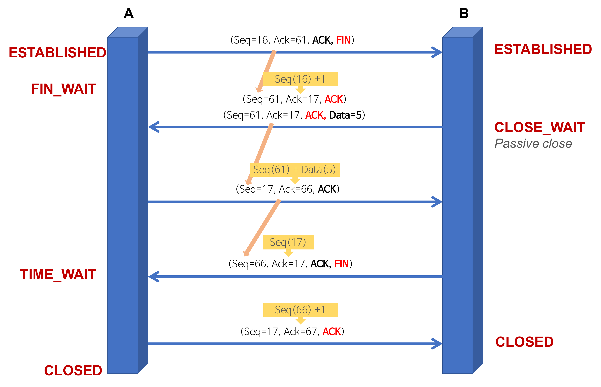

TCP는 네트워크 계층 중 **전송 계층에서 사용하는 프로토콜** 중 하나로, **신뢰성을 보장하는 연결형 서비스**이다.

TCP의 **3-way-handshake**란 TCP 통신을 시작하기 전에 논리적인 경로 **연결을 수립 (Connection Establish)** 하는 과정이며, **4-way-handshake**는 논리적인 경로 **연결을 해제 (Connection Termination)** 하는 과정이다. 이러한 방식을 Connect Oriented 방식이라 부르기도 한다.

### TCP 3-way-handshake : Connection Establish

3-way-handshake 과정을 통해 양쪽 모두 데이터를 전송할 준비가 되었다는 것을 보장한다.

#### A 프로세스(Client)가 B 프로세스(Server)에 연결을 요청

1. **A**(CLOSED) **→ B**(LISTEN) **: SYN(a)**
  - 프로세스 A가 연결 요청 메시지 전송 (SYN)
  - 이 때 Sequence Number를 임의의 랜덤 숫자(a)로 지정하고, SYN 플래그 비트를 1로 설정한 segment를 전송한다.
2. **B**(SYN_RCV) **→ A**(CLOSED) **: ACK(a+1), SYN(b)**
  - 연결 요청 메시지를 받은 프로세스 B는 요청을 수락(ACK)했으며, 요청한 A 프로세스도 포트를 열어달라(SYN)는 메시지 전송
  - 받은 메시지에 대한 수락에 대해서는 Acknowledgement Number 필드를 (Sequence Number + 1)로 지정하여 표현한다. 그리고 SYN과 ACK 플래그 비트를 1로 설정한 segment를 전송한다.
3. **A**(ESTABLISHED) **→ B**(SYN_RCV) **: ACK(b+1)**
  - 마지막으로 프로세스 A가 수락 확인을 보내 연결을 맺음 (ACK)
  - 이 때, 전송할 데이터가 있으면 이 단계에서 데이터를 전송할 수 있다.

최종 PORT 상태 : A-ESTABLISHED, B-ESTABLISHED (연결 수립)

### TCP 4-way-handshake : Connection Termination

#### A 프로세스(Client)가 B 프로세스(Server)에 연결 해제를 요청

1. **A**(ESTABLISHED) **→ B**(ESTABLISHED) **: FIN**
  - 프로세스 A가 연결을 종료하겠다는 FIN 플래그를 전송
  - 프로세스 B가 FIN 플래그로 응답하기 전까지 연결을 계속 유지
2. **B**(CLOSE_WAIT) **→ A**(FIN_WAIT_1) **: ACK**
  - 프로세스 B는 일단 확인 메시지(ACK)를 보내고 자신의 통신이 끝날 때까지 기다린다.
  - Acknowledgement Number 필드를 (Sequence Number + 1)로 지정하고, ACK 플래그 비트를 1로 설정한 segment를 전송한다.
  - 그리고 자신이 전송할 데이터가 남아있다면 이어서 계속 전송한다. (클라이언트 쪽에서도 아직 서버로부터 받지 못한 데이터가 있을 것을 대비해 일정 시간동안 세션을 남겨놓고 패킷을 기다린다. 이를 TIME_WAIT 상태라고 한다.)
3. **B**(CLOSE_WAIT) **→ A**(FIN_WAIT_2) **: FIN**
  - 프로세스 B의 통신이 끝나면 이제 연결 종료해도 괜찮다는 의미로 프로세스 A에게 FIN 플래그를 전송한다.
4. **A**(TIME_WAIT) **→ B**(LAST_ACK) **: ACK**
  - 프로세스 A는 FIN 메시지를 확인했다는 메시지를 전송 (ACK)
  - 프로세스 A로부터 ACK 메시지를 받은 프로세스 B는 소켓 연결을 해제한다.

최종 PORT 상태 : A-CLOSED, B-CLOSED (연결 해제)